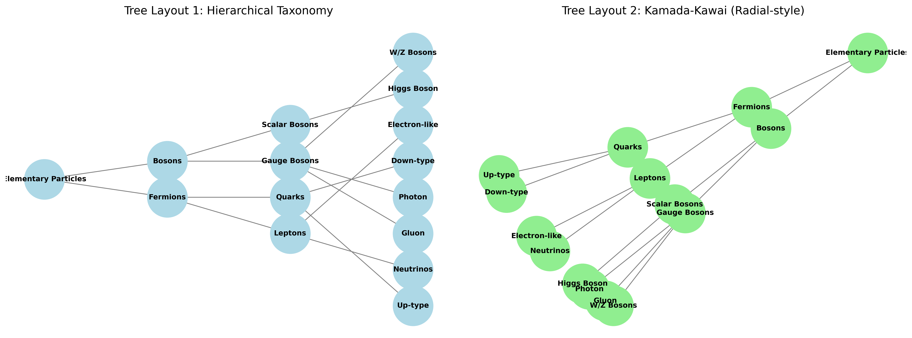
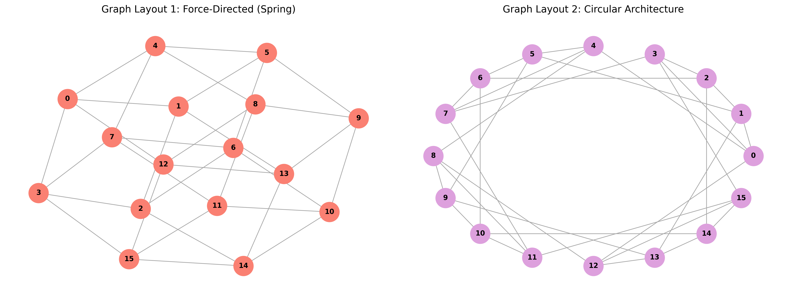

# Network Architecture Visualizations
**Assignment 4**

## 1. Dataset Selections
* **Tree Dataset:** The Standard Model of Particle Physics Taxonomy.
* **Graph Dataset:** 4x4 Torus Interconnect Network.

---

## 2. Tree Dataset (Standard Model Taxonomy)
* **Source:** A custom hierarchical dataset curated from the theoretical physics classification of elementary particles.
* **Nodes Represent:** Categories of particles (e.g., Fermions, Bosons) and specific fundamental particles (e.g., Up Quark, Electron, Higgs Boson).
* **Edges Represent:** A taxonomic "is a sub-category of" or "contains" relationship, branching from a central root down to specific particle classifications.

### Visualizations

---

## 3. Graph Dataset (Torus Interconnect Mesh)
* **Source:** A synthetically generated dataset modeling a standard parallel computing architecture, commonly used in supercomputer network topologies. Generated using `NetworkX`.
* **Nodes Represent:** Compute nodes or individual processors within a distributed system.
* **Edges Represent:** Direct, bi-directional physical communication links between adjacent processors in the mesh.

### Visualizations

